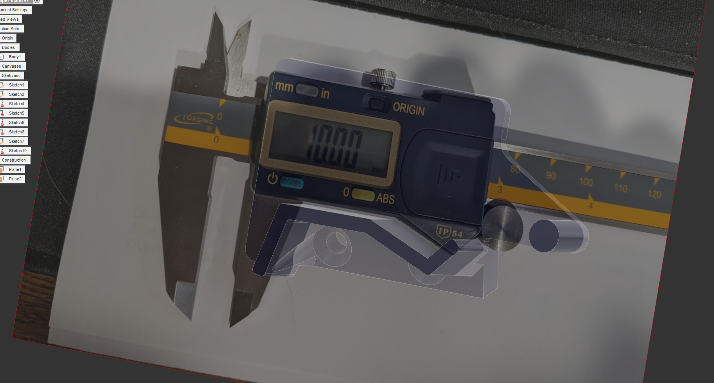

# Caliper Holders

Idea from here: https://www.reddit.com/r/3Dprinting/comments/mc7xiy/i_like_to_keep_my_calipers_close_by_at_my_desk/

# Changelog

2021/03/26 - Initial commit

## Design

Autocad Fusion 360 

## Slicer

Ultimaker Cura 4.8.0
- Printer: Creality CR6 SE
- Layer Height: 0.2mm
- Infill Density: 20%
- Infill Pattern: Grid
- Filament: Inland PLA+ 1.75mm Blue
- Material: PLA+
- Print Temperature: 215 degrees C

# Preview

